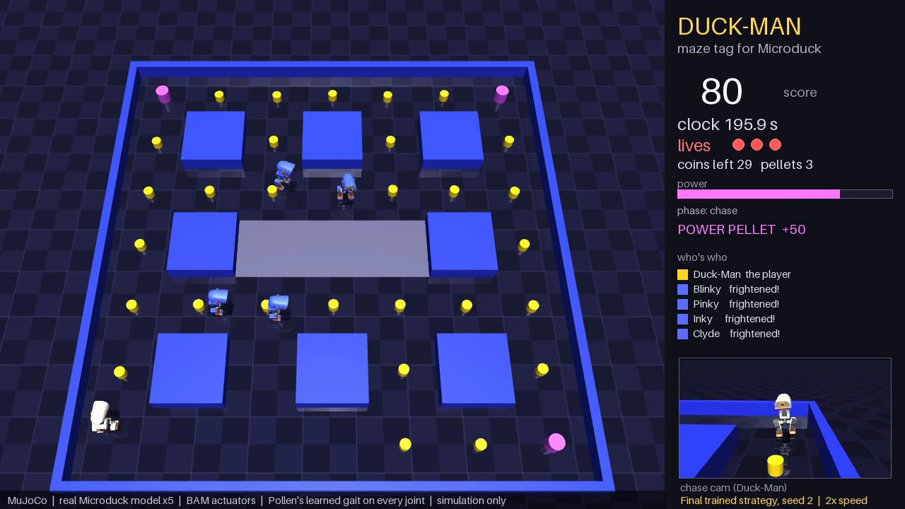
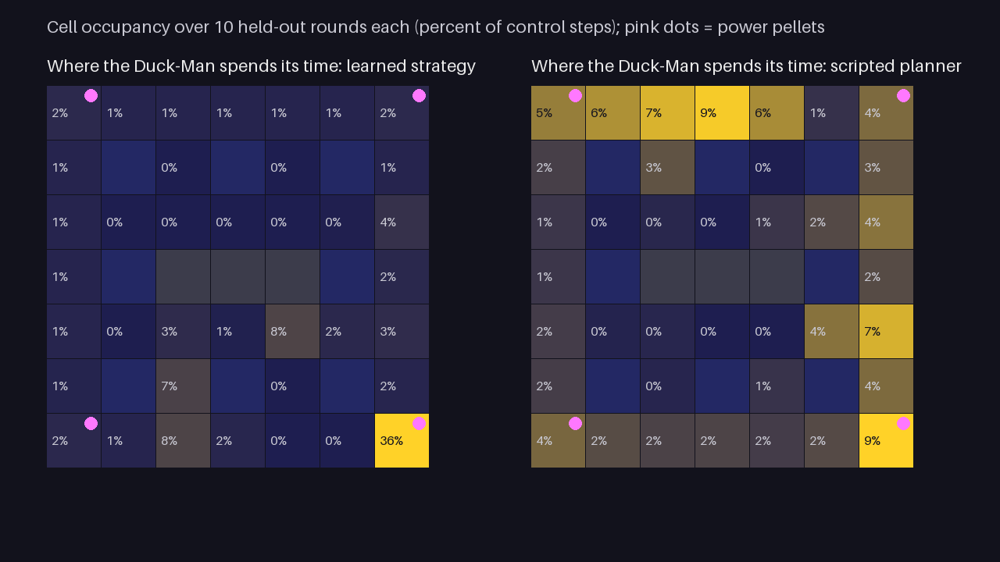

# Duck-Man: maze tag for Microduck

Entry for the HIM Arena **Microduck · Best Sports Sim** challenge (`microduck-sports-sim-2026`).
Public repository: https://github.com/nyle-prosal/duckman-microduck



Five real Microducks play maze tag in MuJoCo. One Duck-Man collects coins by physically knocking
them over, four ghosts chase it, and a power pellet reverses the chase for twelve seconds. Every duck
walks with Pollen Robotics' published learned gait through the BAM actuator model. Two policies were
trained for this entry: a **stand-up policy** (reinforcement learning, Pollen's training stack, one
GPU) that lets a tagged or fallen duck get back up, and the **Duck-Man strategy network**
(behaviour cloning of our scripted planner, then evolution strategies inside this simulation on a
laptop CPU). Simulation only; no hardware claims.

## At a glance

- **Five real Microducks** (Pollen's MJCF and meshes, unmodified) in one MuJoCo scene, every joint of every
  duck driven by a learned network at 50 Hz. It is the only multi-duck entry under fully learned locomotion.
- **The only entry using Pollen's BAM voltage-level actuator model** (XL330 M6), one controller per duck,
  the same physics the gaits were trained against, not plain PD servos.
- **Two policies trained here:** a stand-up policy on the actual Microduck through Pollen's own training
  task (a 7,000-iteration PPO run, one GPU; the shipped export is the 4,499 checkpoint) and the Duck-Man strategy network (behaviour cloning, then evolution
  strategies inside this simulation on a laptop). Curves, checkpoints and failures are all in the package.
- **Evidence a judge can run:** `./run.sh` reproduces tests, four baselines and the video on CPU in 20-30 min;
  60 held-out seeds with paired statistics; a mechanical test that no rollout code writes simulator
  state; per-file provenance hashes.
- **Caveats:** the learned strategy's edge over our scripted planner is modest; the stand-up policy
  cannot recover from face-up; the gait is slow, so the full round is shown at 2× (labelled) after a
  real-time segment.

## What is learned and what is scripted

| Layer | Type | Who made it | Evidence |
|---|---|---|---|
| **Stand-up policy** (14 joint targets at 50 Hz, recovers from sitting and face-down) | **trained here**: PPO on `Mjlab-StandUp-Flat-MicroDuck` from Pollen's `microduck_rl`, 4,096 envs on one 24 GB GPU, 7,000 iterations; the shipped export is the 4,499 checkpoint (7,000 measured the same) | this entry | `assets/policies/standup.onnx` (exported with Pollen's exporter, normalizer baked in); training logs and checkpoints in the repository's `training/standup/` notes |
| **Duck-Man strategy** (which cell to go to next) | **trained here**: initialised by behaviour cloning of our scripted planner (8,928 decisions), then evolution strategies with full MuJoCo rollouts, elitism on a 6-layout pool | this entry | `checkpoints/strategy_final.npz` (sha256 in `results/learned_seed0.json`), `checkpoints/curve.csv`, `training/strategy/` (all four runs, including the failed ones) |
| Cell navigation (turn, kick-start, walk to a cell centre) | scripted controller | this entry | `duckman/navigator.py` |
| Ghost behaviour (chase / ambush / mirror / shy, scatter waves, flee, go home) | scripted controller | this entry | `duckman/ghosts.py` |
| Scripted planner baseline (BFS with ghost-danger cost) | scripted controller | this entry | `duckman/planner.py` |
| Walking, standing, sit-and-stand gaits | learned (PPO), **unmodified** | Pollen Robotics, `pollen-robotics/microduck-policies` | `assets/policies/alpha_*.onnx` |
| Actuator physics | BAM XL330 M6 voltage model, **one controller per duck** | Rhoban / Pollen | `duckman/bam_loader.py` |

**Balance assistance: none.** No fixed base, no external stabilisation, no joint animation. All 70
servos of all five ducks are driven only by the ONNX gait networks, every control step, and each
policy object's `act()` is the only writer of joint targets (`duckman/policies.py`). The labelled stand-up demo
(`duckman/demo_standup.py`) drives one duck's targets directly and is not a scored round.
**Observation:** the strategy layer sees perfect game state (positions, coin states, ghost modes);
every gait network sees proprioception only, exactly as on the robot.
**Render-only cues:** collected tokens become invisible and inert (they still rest on the floor);
frightened ghosts turn blue; the powered Duck-Man flashes. No physics is changed by these.

## Rules

3 lives, 240 s clock. Coin +10 (7 cm token; counts when the Duck-Man has touched it and it is
toppled or knocked ≥ 6 cm from its spawn), power pellet +50 (four, one per corner; 12 s of power),
ghost caught in power mode +200 (it walks home), maze cleared +500. A **tag** is body contact between
a ghost and the unpowered Duck-Man: it loses a life, holds still while the ghosts turn away, sits,
and stands back up (sit-and-stand policy when seated, stand-up policy when it was knocked over)
once every ghost has backed off three cells. Ghosts alternate arcade scatter and chase waves.
Nothing is ever teleported. Ghosts pass through each other and through tokens (collision groups); all
other contact is ordinary physics.

## Results

Held-out seeds 0–59 (evolution used layouts 1000–1005, behaviour cloning seeds 2000–2039). Same seed = same maze jitter, spawn
noise and ghost RNG for every policy, every policy gets the full 240 s clock. Two disabled baselines:
**neutral** keeps Pollen's balance network running but never chooses a cell, **frozen** has no
network at all (default pose held by the actuator model).

<!-- bench:start -->
| Policy | Seeds | Mean score | Std | Mean coins | Ghosts caught | Lives lost | Rounds to the clock | Falls |
|---|---|---|---|---|---|---|---|---|
| learned | 60 | **406** | 90 | 19.0 | 0.17 | 2.67 | 20/60 | 52 |
| planner | 60 | **360** | 98 | 18.9 | 0.03 | 2.15 | 39/60 | 55 |
| neutral | 60 | **0** | 0 | 0.0 | 0.00 | 2.88 | 5/60 | 54 |
| frozen | 60 | **0** | 0 | 0.0 | 0.00 | 0.00 | 0/60 | 60 |

Paired per-seed difference (learned - planner): mean +45 points, 95% bootstrap CI [+12, +79]; learned wins 29/60 seeds (0 ties), two-sided sign test p = 0.90. The mean difference is statistically significant (bootstrap CI excludes 0); the win rate is not significant (sign test): the learned policy wins fewer rounds than it loses, but wins by more.
<!-- bench:end -->

A third scripted baseline, the 20-line greedy strategy shipped as `examples_api/my_strategy.py`
(nearest coin, pellet when threatened), scores **387 ± 124** on the same 60 seeds
(`results/extra_GreedyCoinStrategy.json`): more coins than either, almost no ghost hunting (3 catches in 60 rounds). The learned
strategy stays ahead of both scripted baselines; the gap to the planner is the one we test statistically.

Seed 0 is the causality seed; seed 2 is the round shown in full in the video (both held out, both
produced by `./run.sh`):

<!-- results:start -->
| Seed | Policy | Score | Coins | Pellets | Ghosts caught | Lives lost | End | Time | Falls |
|---|---|---|---|---|---|---|---|---|---|
| 2 | Duck-Man[trained strategy network (ES)] | **780** | 18 | 4 | 2 | 2 | timeout | 240.0 s | 1 |
| 2 | Duck-Man[scripted planner] | **430** | 23 | 4 | 0 | 1 | timeout | 240.0 s | 0 |
| 0 | Duck-Man[trained strategy network (ES)] | **390** | 19 | 4 | 0 | 3 | game_over | 203.14 s | 2 |
| 0 | Duck-Man[scripted planner] | **640** | 24 | 4 | 1 | 1 | timeout | 240.0 s | 2 |
| 0 | Duck-Man[neutral (always stay)] | **0** | 0 | 0 | 0 | 3 | game_over | 203.84 s | 3 |
| 0 | Duck-Man[frozen: default pose, no network] | **0** | 0 | 0 | 0 | 0 | fell_unrecoverable | 10.66 s | 1 |
| 0 | Duck-Man[strategy network, generation 0 (untrained)] | **180** | 8 | 2 | 0 | 0 | stopped at 40 s (evaluation window) | 40.0 s | 0 |
<!-- results:end -->

**Causality test** (`tests/test_eval_causality.py`, run by `./run.sh`): the trained strategy must
score ≥ 200 with ≥ 12 coins on seed 0; the neutral and frozen Duck-Men collect 0 coins in their whole
round (the neutral duck loses its three lives at 204 s, the frozen one falls at 11 s); every policy's call count equals the number of control steps; gait actions are finite and
bounded. **Mechanical trust check** (`tests/test_no_sim_writes.py`): an AST walk over every function
in `duckman/` fails if anything outside the allow-listed reset paths assigns to `qpos`, `qvel`, `ctrl`,
`xfrc_applied`, `qfrc_applied` or mocap fields, or calls `mj_resetData`. **How to read the paired statistics:** over 60 held-out seeds the learned strategy scores +45
points more on average than our scripted planner and the bootstrap interval excludes zero, but it wins
only 29 of 60 rounds. It loses small and wins big: what it learned that the planner never does is to hunt
ghosts during power windows (+200 each), at the cost of spending its lives faster. On seed 0 the planner
happens to win; we report every seed rather than pick one. The two disabled baselines tell the other
half of the story: the neutral duck, balance network running, is caught 2.9 times per round and scores 0;
the frozen duck, no network at all, falls over in every round. Pollen's gait does the balancing and the
strategy layer does the playing.

Every number above maps to a file in `evidence/README.md`; every shipped asset and checkpoint is
hashed with its upstream URL in `assets/PROVENANCE.json`.


### Ghost League: the ghosts learn too (co-evolution, one round)

We pointed the same evolution trainer at the ghosts: one network shared by all four, deciding the next
cell while hunting (fleeing and walking home stay scripted), fitness = minus the Duck-Man's score plus a
bonus per tag, evolved against the **frozen** learned Duck-Man on the training pool
(`duckman/train_ghosts.py`, curve in `training/strategy/ghosts_curve.csv`). Four generations were enough:

<!-- league:start -->
| Duck-Man \ ghosts | scripted ghosts (arcade personalities) | learned ghosts (co-evolved vs the learned Duck-Man) |
|---|---|---|
| learned strategy (shipped) | **426** ± 114 (tags 2.75, catches 0.25) | **18** ± 4 (tags 3.00, catches 0.00) |
| scripted planner | **378** ± 115 (tags 2.10, catches 0.10) | **379** ± 86 (tags 0.35, catches 0.00) |

Mean Duck-Man score ± std over held-out seeds 0-19; tags = lives lost per round; catches = ghosts caught per round.
<!-- league:end -->

The table shows what one round of co-evolution does. The learned ghosts found the learned
Duck-Man's corner-camping habit and annihilate it: 426 → 18, three tags every round, zero catches. But they
**overfit to that one opponent**: the scripted planner, which sweeps the maze instead of camping, scores 379
against them with only 0.35 tags per round, because the learned ghosts are waiting in the wrong corner. So one
round of learning produced ghosts that are lethal against the policy they trained against and harmless against
a different one. That is both the point of the experiment and its limit: it is one round of an arms
race, run in the last hours before the deadline. The shipped Duck-Man, all headline numbers and the video use the scripted arcade ghosts; the
learned ghosts are an extra result (`checkpoints/ghosts_final.npz`, `python -m duckman.eval --ghosts learned`,
`python -m duckman.league`). The obvious next step is to evolve the Duck-Man back against them.

### Did training actually help? The generation ladder on held-out seeds

<!-- ladder:start -->
| Stage | Mean score | Std | Mean coins | Ghosts caught | Lives lost |
|---|---|---|---|---|---|
| random init (generation 0) | **180** | 0 | 8.0 | 0.00 | 2.90 |
| imitation of the planner only | **300** | 71 | 16.1 | 0.00 | 2.75 |
| evolution, generation 5 | **450** | 120 | 17.2 | 0.55 | 3.00 |
| evolution, generation 20 (shipped) | **426** | 114 | 19.1 | 0.25 | 2.75 |

Held-out seeds 0-19, full 240 s rounds, identical ghosts and maze per seed.
<!-- ladder:end -->

Imitation alone gets the network to 300; evolution adds the ghost-hunting and another 125–150 points.
Generation 5 and generation 20 are within noise of each other on these seeds (std ≈ 115 at n = 20). We
ship generation 20 because it was selected as the elite **on the training pool only**; picking a
checkpoint by its held-out score would make the held-out numbers meaningless, so we did not.

### Robustness across Pollen's battery-voltage range

<!-- robustness:start -->
| Battery (BAM vin) | Learned mean score | Planner mean score | Learned lives lost | Planner lives lost | Falls (all ducks, learned / planner) |
|---|---|---|---|---|---|
| 6.5 V | **375** | 369 | 2.50 | 1.70 | 14 / 9 |
| 7.4 V (nominal) | **415** | 383 | 2.60 | 1.90 | 8 / 19 |
| 8.2 V | **410** | 337 | 2.80 | 2.50 | 19 / 20 |

Seeds 0-9 per cell. 6.5-8.2 V is the per-env battery range Pollen randomises during gait training; every duck's actuators run at the given voltage.
<!-- robustness:end -->

The whole system (five gaits, the stand-up policy, the strategy) runs under the same BAM voltage model
Pollen randomises during training. Across the full 6.5–8.2 V range the learned strategy stays ahead of the
planner and no duck fails to stand; the gaits are more fall-prone at both extremes, exactly as the
actuator model predicts.

### What the strategy actually learned

<!-- analysis:start -->
| Behaviour (mean per round, 10 held-out seeds) | Learned | Planner |
|---|---|---|
| pellets collected | 3.60 | 3.40 |
| time to first pellet (s) | 41 | 11 |
| ghosts caught | 0.20 | 0.10 |
| power windows with at least one catch | 0.20 | 0.10 |
| tags suffered | 2.60 | 1.90 |
| of which during own power window | 0.00 | 0.00 |
| time to first tag (s) | 117 | 151 |
| score | 415 | 383 |
<!-- analysis:end -->



The heat map tells the story: the learned Duck-Man **camps the bottom-right pellet corner** for
about a third of each round, waits for ghosts to come to it, takes the pellet when they are close and
then hunts them during the power window. It reaches its first pellet later than the planner (41 s vs
11 s), catches twice as many ghosts, and pays for the ambush with more tags. The planner sweeps the maze
methodically. Neither behaviour was scripted into the network; the camping strategy is what evolution
found under a score that pays 200 for a ghost and 10 for a coin. We consider it a real, if slightly
cheeky, result, and exactly the kind of exploit an objective score invites.

## Reproduce

```bash
./run.sh                    # venv, pinned deps, tests, evaluations, result.mp4   (CPU only, 20-30 min)
./run.sh quick              # ~4 min: tests + the seed-0 causality pair, no video
./run.sh train --run r --generations 300 --pop 48 --seeds 3 --workers 10 --sigma 0.03 --lr 0.005 \
    --resume checkpoints/strategy_final.npz            # optional: continue evolving the strategy
python -m duckman.imitate --rounds 40                  # optional: rebuild the behaviour-cloning init
python -m duckman.bench --seeds 60                     # optional: the 60-seed table above (hours on CPU)
python -m duckman.eval --policy learned --seed 7 --checkpoint checkpoints/strategy_final.npz --video x.mp4
```

Python ≥ 3.12; `./run.sh` needs PyPI only (the BAM actuator library is vendored as a wheel in
`vendor/`, built from Rhoban/bam @ 62bd8ce). Evaluation is deterministic on CPU for a given seed **on one platform**; across platforms (macOS vs Ubuntu) the
floating-point differences make the chaotic contact physics diverge, so scores differ while the causality pattern holds
(Ubuntu 24.04, seed 0: learned 340 / 19 coins, planner 220, neutral 0, frozen 0; JSONs in `evidence/linux/`).
**Headless Linux:** MuJoCo needs EGL or OSMesa for the offscreen video (`apt-get install -y libosmesa6`, software rendering, always works; or EGL with a GPU driver;
`run.sh` picks whichever is present). Without either, every test and evaluation still runs and only the video
steps are skipped with a warning. Verified on a HIM Arena CPU machine: 26 tests and all evaluations pass on
Ubuntu; the video renders with OSMesa (verified), while EGL failed on that GPU-less VM. Retraining the stand-up policy
needs a CUDA GPU and Pollen's `microduck_rl` at commit 29e887e:
`uv run train Mjlab-StandUp-Flat-MicroDuck --env.scene.num-envs 4096 --agent.max_iterations 7000 --agent.logger tensorboard`
then `uv run scripts/export.py Mjlab-StandUp-Flat-MicroDuck --checkpoint-file <model_N.pt>` (the shipped file is the 4,499 checkpoint; 7,000 measured the same).

## Play it, or plug in your own strategy

```bash
python -m duckman.play --seed 0            # drive the Duck-Man with WASD/arrows against the ghosts (MuJoCo viewer)
python examples_api/my_strategy.py         # a 20-line strategy: greedy coins, pellet when threatened
```

A strategy is any object with `reset(seed)` and `choose(view, cell, options) -> next cell or None`. It
never touches joints or physics; the scripted navigator and Pollen's learned gait turn its choice into
motion, and the same causality tests apply to it. Score yours with `duckman.bench` and compare against the
tables above. Neither of these is part of the scored evaluation.

## Video

`result.mp4` (3 min 41 s) = cold open: the seed-2 power window and ghost catch (2×) → title card → 20 s
of seed 2 in **real time, unedited** → generation-0 clip (untrained network, 2×) → neutral-baseline clip
around its first tag (real time) → the full seed-2 round (2×) → stand-up policy demo (spawned face-down,
trained policy only, labelled as a demo, not a scored round) → strategy training curves → stand-up training
curve → end card with the numbers from `results/*.json`. `SUBMISSION.md` has a timestamped viewing guide.
The side panel, ticker, legend and chase-cam inset are drawn by the renderer from game state; the
physics view is the evaluation itself. Seed 2 was chosen after the
60-seed benchmark as the round where the learned policy's ghost-hunting shows best; the benchmark
table above reports every seed, wins and losses alike. Clips are unedited renders of the evaluation runs; only the playback speed is
changed, and it is burned into the frame.

## Limitations

- Simulation only. Nothing here is evidence of hardware behaviour.
- The strategy layer uses perfect game state; a real robot would need perception.
- Pollen's gait walks at ~0.15 m/s and cannot strafe, so the game is slow and turn-heavy; 2×
  playback is used for watchability.
- **Face-up recovery does not work.** The stand-up policy rises from sitting (4/4) and face-down
  (6/6) but not from its back (0/8 across roll angles) after 7,000 iterations, nor after a further 1,100
  iterations with 60% face-up spawns (`training/standup/README.md`, negative result). A Duck-Man knocked
  onto its back stays down and loses its remaining lives to tags. That is a fair knockout, but a gap. For
  context: no published Microduck policy we could find (Pollen's set, 31 community repos, every other
  entry) recovers from face-up either; ours is the only recovery skill in the field at all.
- The learned strategy is aggressive: in 40 of 60 rounds it spends all three lives before the clock,
  typically around 220 s, hunting ghosts. Under the scoring rules that is the higher-scoring choice; it does make rounds shorter.
- Training seeds are six maze layouts; generalisation to held-out seeds is shown above, but the maze
  shape itself is fixed.

## Next ideas

1. **Duck-Man Dodgeball.** Replace power pellets with a ball the Duck-Man kicks down a corridor to
   knock out a ghost. Corridors solve the aiming problem (blind kick spread ±8° → ±6–12 cm at one to
   two cells, inside a 45 cm corridor); the hard part is kick alignment (±1.5 cm) with a navigator
   that arrives within 6 cm.
2. Train the strategy end to end from its own rollouts with more seeds per generation once compute
   allows; the current policy plateaued around fitness 200 on the pool.
3. Face-up recovery: Pollen's roll-noise curriculum did not transfer within our budget; a
   reverse-curriculum from near-on-side starts is the obvious next experiment.
4. Fewer, faster ghosts and a larger maze once a faster gait is available.

## Attribution

See `THIRD_PARTY_NOTICES.md`. Microduck model and policies © Pollen Robotics (Apache-2.0 code and
policies, CC BY-SA-NC 4.0 meshes). BAM by Rhoban. This entry's code is Apache-2.0, copyright 2026 Nyle Malik.
